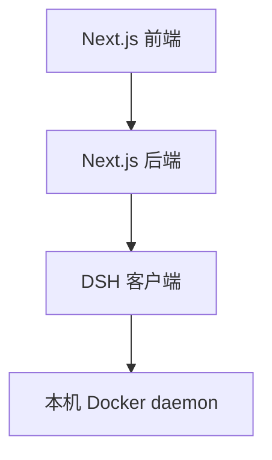
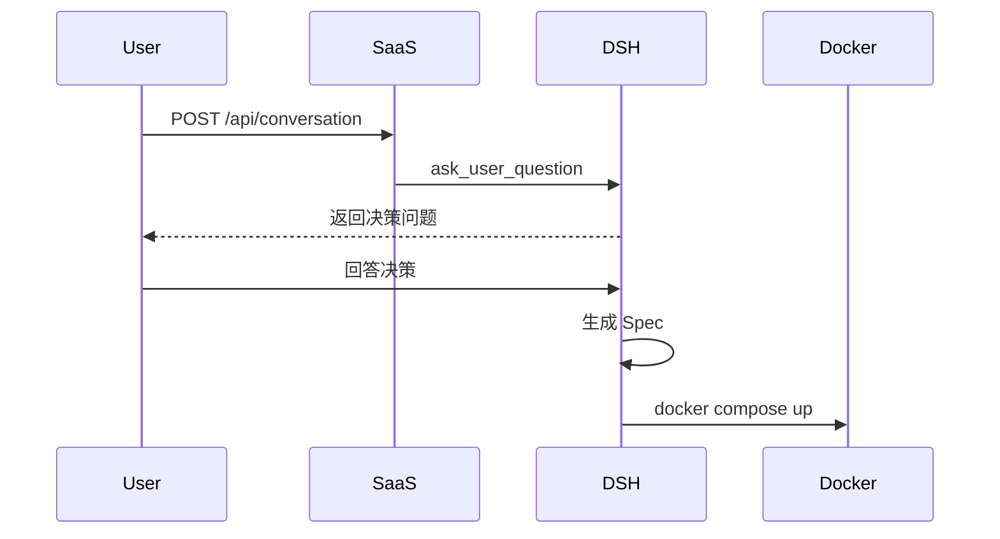
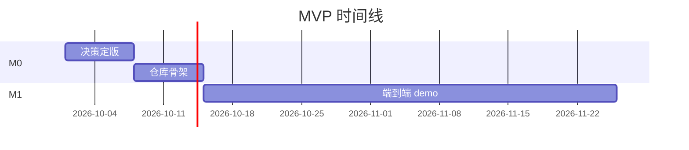
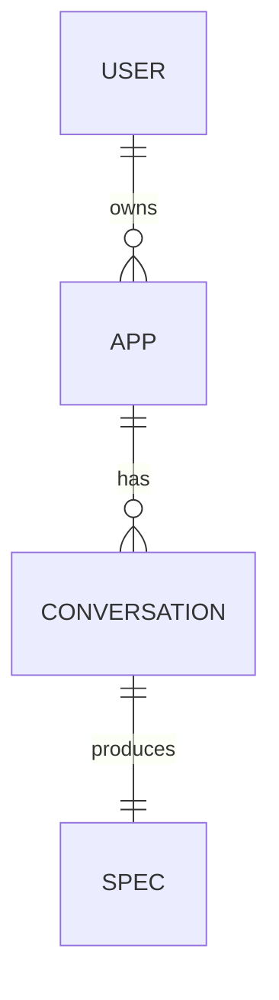

# 报告撰写 SOP（v1）

> **本文件是「深度分析四准则 · 准则 4 · 多层报告结构」的可执行 SOP**。
> 当撰写组 B 需要把上游调研/分析产物整合成最终报告时，按本 SOP 执行。

---

## 一、为什么需要这个 SOP

### 三个现实问题

1. **准则 4 要求"报告至少 3 层：篇 → 章 → 节 →（深读块）"，但没给模板**。每个撰写组 B 的 brief 都要重新描述一遍结构，浪费 20-30 分钟
2. **报告质量参差不齐**：有的写成了"调研结果的二次重写"（逐段搬运，无整合），有的忘了 evidence 引用，有的 mermaid 图渲染失败
3. **MVP 路径 + 决策清单经常缺失**：用户拿到报告无法立刻行动

### 核心思想

> **报告不是"调研结果的搬运"，而是"对调研结果的二次解读 + MVP 路径 + 决策清单"**。没这三块的报告就是失败品。

---

## 二、报告结构 SOP（必填模板）

```
# {产品/项目} · {报告类型}（如：技术选型 / 原理分析 / 竞品研究）

## 0. 执行摘要（300-500 字，6 要素）
- 项目定位
- 推荐结论速览表（一张表，14 Q 各一行）
- 关键决策 N 条
- 主要风险 N 条
- 推荐下一步 N 条

## 1. 产品定位与架构方向
- 产品定位（mermaid 用户视角流程图）
- 架构方向（mermaid 架构图，前端/后端/客户端/部署）
- 为什么这样设计（3-5 条理由 + 风险表）

## 2. 核心结论（每个 Q 一个章节）
### Q{N}. {问题名}
- 候选 / 推荐 / 对比矩阵 / 决策依据 ≥3 / 落点 / 死因
- 决策依据带 [src: E{nn}] 引用（指向 evidence-ledger.md）
- 对比矩阵 ≥ 4 行 × 3 列

## 3. 联合解读（章节可选但推荐）
- 不同栈之间的协同（如 LiteLLM ↔ DSH / Clerk ↔ DSH 客户端）
- 跨章节的横向对比

## 4. 实施路径（pdc 第 4 准则要求）
- M0/M1/M2/M3 + 周交付物清单
- 时间线 Gantt 图

## 5. TODO 回填表（推荐选型 → 决策项映射）
- 表格：TODO 项 | 推荐选型 | 备注 | 涉及 Q
- 帮助用户直接把报告结论写回 TODO.md

## 6. 风险与待澄清
- 必须立即澄清（战略决策，3-5 条）
- 中期跟踪（季度风险，5-8 条）
- 长期预警（年度预警，3-5 条）

## 附录 A · 调研过程
- 双轨调研清单（轨道 A URL + 轨道 B 项目）
- evidence-ledger 索引（按 Q 分组列出 E001-Enn）
- 上游所有交付物清单

## 附录 B · 关键可视化资产
- mermaid 流程图（端到端 + 部署 + 时序）
- 能力对照表 / 对比表（复杂场景必备）

## 附录 C · 决策清单
- 明天醒来决策清单（3-5 条）
- 每个标"为什么必须 / 备选 / 不拍板的代价"
```

### 强制要求（写在 brief 里）

| 维度 | 要求 |
|---|---|
| 总字数 | 8000-12000 字（含表格） |
| mermaid 图 | ≥ 5 个 |
| 对比矩阵 | ≥ 30 个（每 Q 一个 + 跨章节解读）|
| evidence 引用 | ≥ 50 条（覆盖 ledger 80%+）|
| MVP 阶段 | M0/M1/M2/M3 全 4 阶段 |
| 决策清单 | 3-5 条 |

---

## 三、brief 模板（主控派给撰写组 B 用，可直接复制）

```markdown
你是 pdc-team-workflow 的 B 执行员（内容撰写组）。任务：整合 {上游产物路径}，产出 {产品名} 的 **{报告类型}** 报告。

## 必读背景（按顺序读，不许跳）
1. {调研 plan 路径}
2. {调研 draft 路径}
3. {调研 evidence-ledger 路径}
4. {调研 check 路径}
5. {上游分析产物路径（如果有）}
6. {用户原 TODO 路径（用于回填表）}

## 产品上下文（已锁定，不要改）
{一段话描述：用户是谁 / 核心链路 / 架构方向 / 已锁定的技术决策}

## 你的任务
- 报告结构：严格遵循 `references/报告撰写SOP.md` §二
- 强制要求：8000-12000 字 + ≥5 mermaid + ≥30 对比矩阵 + ≥50 evidence 引用 + M0-M3 全 4 阶段 + 3-5 条决策清单
- 强制不允许：
  - 不重新调研 / 重新分析 / 重新实验
  - 不推翻上游选型（已 C 闸门放行）
  - 不新增技术选型（仅整合/解读/MVP/回填/风险）
  - 不写代码 / 不做原型 / 不部署
  - 不做架构图设计（仅复用上游 mermaid）

## 产出文件
{具体路径}（建议 8000-12000 字 / ≥100 KB）

## 时长与并行策略
- 预计 {N} 分钟
- {单 B 直接干 / 拆 N 个 sub-subagent 并行}

## 完成后回报
1. 报告总字数 / 章节数
2. 14 Q 覆盖确认
3. mermaid 图 / 表格数量是否达要求
4. MVP 4 阶段是否齐全
5. 决策清单 3-5 条是否齐全
6. evidence 引用数（应 ≥ 50 条）

开始干活。
```

---

## 四、5 个真实反例（避免踩坑）

| # | ❌ 反例 | ✅ 正确做法 |
|---|--------|------------|
| 1 | 报告写成"调研结果的二次重写"，每段重复上游 | 报告重在"整合 + 解读 + MVP 路径"，不复述上游每个细节；上游是素材库，报告是组装品 |
| 2 | 没有 src 引用，读者无法验证 | 每条决策依据必须带 `[src: E{nn}]`（指向 ledger）或 `[src: URL]`（指向一手源） |
| 3 | mermaid 图语法错误导致渲染失败 | 必须用 ` ```mermaid ` 代码块 + 合法语法（见 §五），主控撰写后用 grep 验证闭合 |
| 4 | 没有决策清单 | 必须有「明天醒来决策清单」附录 C，给出 3-5 个可拍板的事，每条含"为什么必须 / 备选 / 不拍板的代价" |
| 5 | MVP 路径空泛"M0 = 决策 / M1 = 开发" | 必须有 M0-M3 四阶段 + 每阶段周交付物清单（W1-W26），不能只列阶段名 |
| 6 | 推荐结论直接搬运调研组结论，不做二次解读 | 报告应解释"为什么这个组合在一起更好"，提供横向对比（如 SaaS 侧栈 vs 客户端栈） |

### 反例展开

**反例 1 · 二次重写**：
```markdown
❌ 错误（搬运）：
"Q1 推荐 LiteLLM。Q1 的候选有 OpenAI 直连、Anthropic 直连、自部署 Ollama、LiteLLM、Portkey。
经对比，LiteLLM 在 provider 数量、统一鉴权、回调 hook、token 计量方面优于其他方案..."

✅ 正确（整合 + 解读）：
"§3.1 SaaS 平台侧栈统一用 LiteLLM 作为 LLM 网关，客户端栈 DSH first-party adapter 双轨。
这种'双层 LLM 接入'让 SaaS 计费平台（Clerk → Lago）和 DSH 客户端（自管 LLM Key）解耦..."
```

**反例 2 · 缺 src 引用**：
```markdown
❌ 错误（无 src）：
"DSH 默认端口是 3080"

✅ 正确（带 src）：
"DSH 默认端口是 3080（[src: E085]，DSH 本地仓库 `apps/web/src/main.ts:40`）"
```

---

## 五、mermaid 图绘制 SOP（撰写组最容易踩坑）

### 5 种最常用的图类型

#### 1. flowchart · 用户视角流程


#### 2. graph · 架构图


#### 3. sequenceDiagram · 时序图


#### 4. gantt · MVP 时间线


#### 5. erDiagram · 数据模型


### 必须避免的 4 个反例

1. ❌ 节点名称含 `()` 或 `[]` 嵌套过深 → 语法错误。**正确**：用字母数字下划线 + `[]` 包节点标签
2. ❌ gantt 用 `MM/DD` 格式 → mermaid 要求 `YYYY-MM-DD` ISO 8601
3. ❌ mermaid 代码块未闭合（漏 ```） → 整篇报告渲染失败。**验证**：`grep -c "^\`\`\`$" final-report.md` 必须是偶数
4. ❌ 中文节点名称直接写但空格用半角 → 渲染时乱码。**正确**：中文 + 半角空格或全角空格统一

### 主控撰写后必跑 4 条 grep 验证

```bash
# 1. mermaid 数量（必须 ≥ 5）
grep -c "^\`\`\`mermaid" final-report.md

# 2. mermaid 代码块闭合（开头数 = 结尾数）
grep -c "^\`\`\`" final-report.md   # 必须是偶数

# 3. evidence 引用数（必须 ≥ 50）
grep -oE "\[src: E[0-9]+\]" final-report.md | wc -l

# 4. 决策清单条目数（必须 3-5）
grep -cE "^### C\.[0-9] " final-report.md
```

---

## 六、与其他文件关联

| 文件 | 关系 |
|---|---|
| `SKILL.md` §四·准则 4 | 上层抽象原则（本文件是它的可执行 SOP）|
| `代码仓调研方法论.md` | evidence 的主要来源 |
| `plan.md`（A 计划员产出）| 决定报告要回答哪些 Q |
| `evidence-ledger.md`（调研 B 产出）| 报告引用的 src 主源 |
| `draft.md`（调研 B 产出）| 报告整合的素材 |
| `check.md`（C 闸门）| 报告里推荐结论的合法性背书 |
| `final-report.md`（撰写 B 产出）| 本 SOP 的直接产物 |
| `check-final.md`（质检 C 闸门）| 用本 SOP 的标准验证撰写工作 |

---

## 七、一句话总结

> **报告不是"调研结果的搬运"，而是"对调研结果的二次解读 + MVP 路径 + 决策清单"**。没这三块的报告就是失败品。